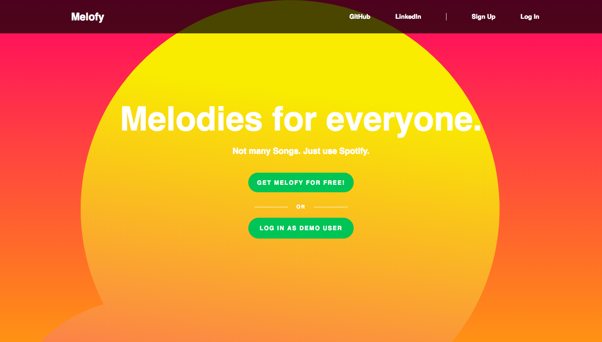

# Melofy

## [Live](https://melofy.herokuapp.com)

## Overview
Melofy is inspired by Spotify, a web app that not only allows users to search and browse songs, artists, and albums, but also to continuously listen to songs as they navigate through the app.

## Technologies
#### Back-End
  * Ruby on Rails
  * PostgreSQL
  * AWS S3

#### Front-End
  * React.js
  * Redux.js

## Key Features

### Search
Users able to search for their favorite artists, albums, and songs within the music app. Users are also able to search for playlists created by other users. Search results are updated after each keystroke.

### Music Player
Users are able to interact with the music player after choosing a song that they wish to listen to without the song being interrupted.

Progress bar not only allows user to know what the current time of the song is, but it also allows the user to seek through the song. They can either click anywhere on the bar to seek to that duration or they can drag the current position to the position that they desire.
