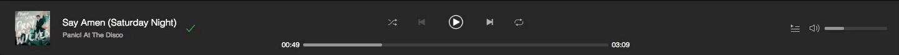

# Melofy

## [Live](https://melofy.herokuapp.com)


## Overview
Melofy is inspired by Spotify, a web app that not only allows users to search and browse songs, artists, and albums, but also to continuously listen to songs as they navigate through the app.

## Technologies
#### Back-End
  * Ruby on Rails
  * PostgreSQL
  * AWS S3

#### Front-End
  * React.js
  * Redux.js

## Key Features

### Search
Users able to search for their favorite artists, albums, and songs within the music app. Users are also able to search for playlists created by other users. Search results are updated after each keystroke.


This is achieved by customizing my `AJAX` get requests to optionally accept a search term parameter and then handled accordingly in the appropriate controller in Rails if `searchTerm` exists in `params`.

```ruby
def index
  if(params[:search_term])
    @artists = Artist.where('name ILIKE ?', "%#{params[:search_term]}%").includes(:albums,:songs)
  elsif (params[:artist_ids])
    @artists = Artist.where(id: params[:artist_ids]).includes(:albums, :songs)
  else
    @artists = Artist.all.includes(:albums,:songs)
  end
end
```

### Music Player
Users are able to interact with the music player after choosing a song that they wish to listen to without the song being interrupted.



Progress bar not only allows user to know what the current time of the song is, but it also allows the user to seek through the song. They can either click anywhere on the bar to seek to that duration or they can drag the current position to the position that they desire.

Making the progress bar seekable was one of the tough challenges that I have faced upon creating my music player. Originally, I was only using the `progress` HTML element to allow the user to be informed of the current time of the song. But this was not enough for me. In order for this to happen, I know that I have to change the `progress` HTML element completely with something else. Then I realized that my volume bar is seekable because it was using the `input` HTML element with `type='range'`. However the template is nowhere near like Spotify's progress bar. What I ended up doing is to make this `input` tag invisible while still interactable with the `CSS` property below:
```CSS
.seeker-bar {
  -webkit-appearance: none;
  ...
}
```
From here I created a `div` with a `div` nested inside which will act as the `progress` bar where the outer `div` will act as the main bar and the inner `div` will act as the current progress.

```HTML
// In JSX
<div className='progress-bar-container'>
  <input className='seeker-bar' type='range' min='0' max={this.state.duration} step='0.25' onChange={this.seek} value={this.state.currentTime}/>
  <div className='outer-bar'>
    <div className='inner-bar' style={{width: `${(this.state.currentTime*100)/this.state.duration || 1}%`}}></div>
  </div>
</div>
```


### Playlist Creation and Customization
Just like Spotify, users are able to create their own playlists and add songs to them. Conversely, users also are able to remove songs from their created playlists and are also able to delete playlists that they have created.

## Future Plans
* Allow users to build out their song queue that's separate from the song list the currently played song belongs to.
* Allow users to upload image for their playlist thumbnails.
* Allow users to look up other users and browse their activity.
